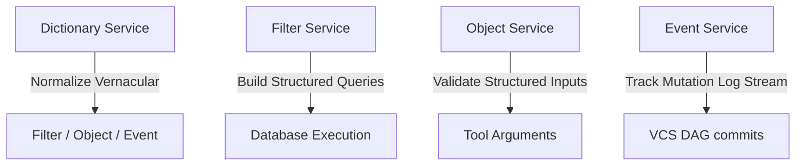

# Middleware Architecture & Coordination

This middleware exposes four stateful services designed to help you construct complex query filters, validate objects, standardise vocabulary, and track structured log events incrementally.

## How the Services Relate

1. **Dictionary Service**: Enforces ontology and resolves user shorthand (e.g. "heart attack" -> "myocardial infarction") before values are injected into filters, objects, or tool functions that require domain-specific vocabulary.
2. **Filter Service**: Allows you to incrementally construct complex query conditions without repeatedly sending the whole filter definition.
3. **Object Service**: Validates structured object data against schemas, using templates to minimise network traffic.
4. **Event Service**: Offers a version-controlled, append-only log array representing changes over time with branching and symmetric merging.
